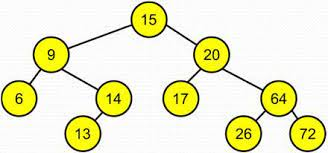
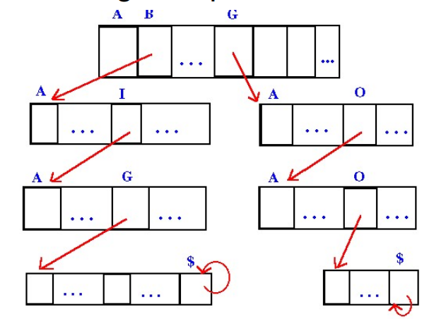

# Programacion Orientada a objetos 

En cada una de las carpetas se encuentra programado una estructura de dato con `C++` o `Java` y a la vez, cada uno tiene sus respectivos tests que demuestran su correctitud.

## Clases en `C++`

Las estructuras estan programadas en los archivos `.h` y `.hpp`, mientras que los Tests se ubican en la carpeta `tests`.  
Las carpetas correspodientes a este lenguaje son: 
* **ListaDobleEnlazada_C++**: En una lista enlazada cada nodo (cada elemento) apunta únicamente
al nodo siguiente de la lista, mientras que en una lista doblemente enlazada cada nodo apunta, además, al nodo anterior. Por otro lado, una lista doblemente enlazada tiene un puntero al primer elemento y un puntero al último elemento  

* **ConjuntosABB_C++**: Implementacion de un conjunto usando un arbol binario de busqueda (ABB) como estructura de representacion.
Un arbol binario es un ABB si y solo si es nil o satisface todas las siguientes condiciones:
 	* Los valores en todos los nodos del subarbol izquierdo son menores que el valor en la raiz.
	* Los valores en todos los nodos del subarbol derecho son mayores que el valor en la raiz.
	* Los subarboles izquierdo y derecho son ABBs.
    

* **DiccionarioTrie_C++**: Implementacion de un diccionario sobre un arbol trie.
Se usa el vector<Nodo*> como un dicc(int, Nodo*). Las claves son string y sus partes son char, en este escenario se asume un abecedario acotado (ASCII, 256 caracteres)

## Clases en `Java`

Las estructuras estan programadas dentro de la carpeta `src`, dentro de ahi, siguiendo las carpetas `main` -> `java` -> `aed` estan las implementaciones `.java`. Ademas, en la carpeta `src` estan los tests en la carpeta `test`.  
Las carpetas correspodientes a este lenguaje son: 
* **VectorDeInts_Java**: Implementacion de una secuencia de enteros. La implementacion se basa en guardar los elementos en un arreglo. Cuando el arreglo se llena, lo que debe hacerse es crear un nuevo arreglo mas grande, copiar los elementos del antiguo arreglo al nuevo, y reemplazar el arreglo viejo por el nuevo.
* **ListaDobleEnlazada_java**: Sigue la misma idea que la Lista Doblemente Enlazada de `C++`
* **ConjuntosABB_java**: Sigue la misma idea que el ABB de `C++`